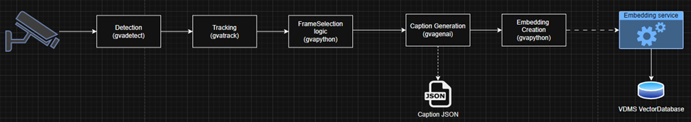

# VRB Proxy Workload - Get Started

GenAI-powered captioning for video stream. Then create embeddings and ingest to vector database to create context on the object detected.



## Prerequisites

- Docker and Docker Compose installed (non-root Docker recommended)
  - [Docker Installation Guide](https://docs.docker.com/get-docker/)
  - [Docker Compose Installation Guide](https://docs.docker.com/compose/install/)
- Host with sufficient CPU/GPU for your chosen OpenVINO model
- OpenVINO-compatible VLM model

## Prepare OpenVINO-compatible VLM model

- Detection model(YOLO):

  Please refer to this [guide](https://github.com/hteeyeoh/edge-ai-libraries/blob/main/microservices/dlstreamer-pipeline-server/docs/user-guide/how-to-download-and-run-yolo-models.md) on how to prepare the detection model.

- VLM model for gvagenai element

  Please refer to this [guide](https://github.com/open-edge-platform/edge-ai-libraries/tree/7a2a442b946c443675a2a566c764523fc87f9c64/libraries/dl-streamer/samples/gstreamer/gst_launch/gvagenai#models-with-gvagenai-element) on how to download and convert the VLM model via optimum-cli command.

Suggest to use python venv to create virtual environment and install the required packages such as openvino, openvino-tokenizers, optimum etc. Then, the steps for converting the model are mostly the same as below:

```bash
optimum-cli export openvino --model <your-model-id-from-huggingface> <output-dir-name> --weght-format <your-desired-weight-format>
# Example:
#optimum-cli export openvino --model google/gemma-3-4b-it gemma-3-4b-it/INT4 --weight-format int4
```

**Do take note that some models maybe gated and required to request for access in Huggingface.**

## Setting up the Application

### Set the Environment Variables

Clone the application code:

```bash
# Clone the repo
git clone https://github.com/hteeyeoh/edge-ai-libraries.git

# Checkout the branch
git checkout remotes/origin/vrb_drop -B vrb

# Goto the code dir
cd edge-ai-libraries/sample-applications/vrb-pipeline/proxy-workload
```

Set the required environment variables before launching the service.

```bash
# For embedding service
# You may change to your desired model which listed under:
# https://github.com/hteeyeoh/edge-ai-libraries/blob/main/microservices/multimodal-embedding-serving/docs/user-guide/supported-models.md
export EMBEDDING_MODEL_NAME=CLIP/clip-vit-b-32

# Configure your rtsp camera ip input source if you have any:
export RTSP_CAMERA_IP=<your-ip>
# you may use 10.223.24.242 from our end

# source the script to setup the environment
source setup.sh
```

### Build the application

```bash
docker compose -f docker/compose.yaml build
```

### Check again on the volume mount for the models and configs

- Models
  By default models are mounted under `../ov_models/:/home/pipeline-server/models` in compose.yaml. So suggested to download models and convert it under `edge-ai-libraries/sample-applications/vrb-pipeline/proxy-workload/ov_models` so that user don't have to modify the volume mounted for models. If you prefer so, feel free to edit the volume path only for system. Keep the volume path in container as `/home/pipeline-server/models`

- Configs
  By default the configs are mounted under `../configs/vrb_workload.json:/home/pipeline-server/config.json`. If user prefer to modify the pipeline or configure it on your own. Feel free to edit the volume path for system only, keep the same volume path for container.

## Start the application services

Start the containers.

```bash
# Head to the directory
cd edge-ai-libraries/sample-applications/vrb-pipeline/proxy-workload

# Bring up the containers
docker compose -f docker/compose.yaml up -d

# The services will take sometime to ready as embedding service will take sometime.
# Run `docker ps` command and user expected to see below:

#CONTAINER ID   IMAGE                                       COMMAND                  CREATED          STATUS                    PORTS                                                                                      NAMES
#7fa3d873de97   vrb_video_publisher:latest                  "./run.sh"               31 seconds ago   Up 30 seconds (healthy)   0.0.0.0:8554->8554/tcp, [::]:8554->8554/tcp, 0.0.0.0:8090->8080/tcp, [::]:8090->8080/tcp   vrb_video_publisher
#69443c3b4b8a   intel/multimodal-embedding-serving:latest   "gunicorn -b 0.0.0.0…"   2 hours ago      Up 31 seconds (healthy)   0.0.0.0:9777->8000/tcp, [::]:9777->8000/tcp                                                multimodal-embedding-serving
#dfd25231eb68   intellabs/vdms:v2.11.0                      "/start.sh"              2 hours ago      Up 31 seconds (healthy)   0.0.0.0:55555->55555/tcp, [::]:55555->55555/tcp                                            docker-vdms-vector-db-1

# Make sure the STATUS of each container is `healthy` before proceed.
```

Start the pipeline.

```bash
# Open another terminal. Run the following curl command:
# Example:
curl http://10.223.22.126:8090/pipelines/user_defined_pipelines/object_detection   -H 'Content-Type: application/json'   -d '{
    "source": {
      "uri": "rtsp://10.223.24.242:8554/stream",
      "type": "uri"
    },
    "parameters": {
	  "frame-selector-properties": {
	    "interested": ["person"]
	  },
      "detection-properties": {
        "model": "/home/pipeline-server/models/yoloworld/v2/FP32/yolov8l-worldv2.xml",
        "device": "CPU",
        "threshold": 0.6
      },
      "captioning-properties": {
        "device": "CPU",
        "model-path": "/home/pipeline-server/models/qwen2vl/",
        "prompt": "Describe what you see in the image in one sentence?",
        "metrics": true,
        "generation-config": "max_new_tokens=100"
      }
        }
}'

# "uri": Replace with your own rtsp server endpoint. If no, you may use the above.
# "interested": You may include several label which mapped to your detection model label to detect and process only the interested object labels.
# "detection-properties": All configuration properties for gvadetect.
#   "model": replace with your own detection model. Expected to start with "/home/pipeline-server/models/<your-model>"
#   "device": Device where model run. At the moment only test with CPU.
#   "threshold": "Confidence level threshold for detection".
# "captioning-properties": All configuration properties for gvagenai.
#  "model-path": Path point to your converted model. Expected to start with "/home/pipeline-server/models/<your-model>"
#  "device": Device where model run on. At the moment only test with CPU
#  "prompt": Prompt for vlm model.
#  "metrics": true to output the metrics. false to disable.
#  "generation-configs": configs set such as `max_new_tokens` to specify number of output token.
```

Check the pipeline output.

```bash
# Detected object frames.
# You may found it under tmp/best_frames/ under your local system path mounted.

# Captions output for the detected object frames.
# You may found it under /tmp/test_captions.json.
cat /tmp/test_captions.json
```

Get pipeline status and STOP pipeline

```bash
# Get the satus of available pipelines
curl --location -X GET http://localhost:8090/pipelines/status

# Stop/Delete the pipeline
# You will get the pipeline-id when you start the pipeline using curl command above. Replace it into the below:
curl --location -X DELETE http://localhost:8090/pipelines/"<your-pipeline-id>"
```

## Validate the embeddings

Create virtual environments and install the depedencies. Next run the pipeline.py script.

```bash
cd edge-ai-libraries/sample-applications/vrb-pipeline/proxy-workload

python -m venv test_embedding

source test_embedding/bin/activate

pip install -r requirements.txt

# Replace <your-query> with your question query.
python pipeline.py "<your-query>"
```

## Stop the containers

Run command below:

```bash
cd edge-ai-libraries/sample-applications/vrb-pipeline/proxy-workload

docker compose -f docker/compose.yaml down
```

## TODO

- [ ] Include support for GPU DLstreamer pipeline.
- [ ] Add support for multiple parallel pipeline triggers in DLstreamer.
- [ ] Further improve on Frame Selection logic.
- [ ] Include UI.
- [ ] Integrate different vector database.
- [ ] Validate on addtional hardware target.

## More References:

- [gvagenai](https://docs.openedgeplatform.intel.com/dev/edge-ai-libraries/dl-streamer/elements/gvagenai.html)
- [gvadetect](https://docs.openedgeplatform.intel.com/2025.1/edge-ai-libraries/dl-streamer/elements/gvadetect.html)